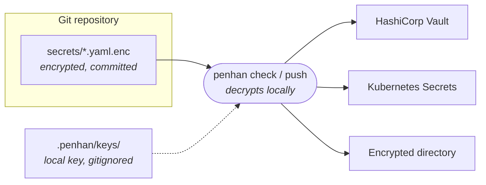

<h1 align="center">penhan</h1>

<p align="center">
  <strong>Keep secrets encrypted in Git. Sync them to Vault or Kubernetes.</strong>
</p>

<p align="center">
  <a href="https://github.com/miladbeigi/penhan/actions/workflows/ci.yml"></a>
  <a href="https://github.com/miladbeigi/penhan/releases/latest"></a>
  <a href="go.mod"></a>
  <a href="LICENSE"></a>
</p>

<p align="center">
  
</p>

penhan is a small CLI for teams that want Git to be the source of truth for their secrets. Secrets live in your repository as encrypted files, reviewed and versioned like code. penhan decrypts them locally and pushes them to the backend your applications read from.

## Features

- **Encrypted at rest in Git**: AES-256-GCM or OpenPGP, with keys generated locally per safe. Plaintext and keys are gitignored automatically.
- **Multiple backends**: HashiCorp Vault KV v2, Kubernetes Secrets, or an encrypted directory.
- **Changes only**: `check` shows what differs from the backend; `push` writes only new and changed secrets.
- **Safe by default**: pins the Kubernetes context, never overwrites resources it doesn't own, never regenerates a missing key, and keeps secret values byte for byte.
- **Adopt what exists**: `penhan import` brings Secrets already in a cluster under management without changing them.
- **Clean diffs**: re-encrypting an unchanged secret leaves its file untouched.
- **Self-updating**: `penhan update` installs the latest verified release.

## How it works



A project holds one or more **safes**. Each safe is a directory with its own `penhan.yaml`, encryption key, and backend settings, so one repository can manage secrets for several apps, environments, or namespaces.

## Install

**Prebuilt binary** (macOS and Linux, amd64 and arm64):

```bash
OS=$(uname -s | tr '[:upper:]' '[:lower:]')
ARCH=$(uname -m | sed 's/x86_64/amd64/; s/aarch64/arm64/')
VERSION=$(curl -fsSLI -o /dev/null -w '%{url_effective}' https://github.com/miladbeigi/penhan/releases/latest | sed 's|.*/v||')
curl -fsSL "https://github.com/miladbeigi/penhan/releases/download/v${VERSION}/penhan_${VERSION}_${OS}_${ARCH}.tar.gz" | tar -xz penhan
sudo install penhan /usr/local/bin/
```

**With Go** (1.26+):

```bash
go install github.com/miladbeigi/penhan/cmd/penhan@latest
```

Update any time with `penhan update`.

## Quick start

```bash
# Create a safe backed by Vault (or --backend=kubernetes / --backend=file)
penhan add myapp --encryption=aes --backend=vault \
  --vault-addr=https://vault.example.com --vault-token-file=./vault-token
cd myapp

# Add a secret: a flat YAML or JSON map
echo "password: s3cr3t" > secrets/db.yaml

penhan encrypt   # secrets/db.yaml -> secrets/db.yaml.enc (commit this)
penhan check     # what would change in the backend
penhan push      # write new and changed secrets
```

Run `penhan add` without flags for an interactive setup. See [Getting started](docs/getting-started.md) for the full walkthrough.

## Documentation

| Guide | |
|---|---|
| [Getting started](docs/getting-started.md) | Safes, the day-to-day workflow, and working as a team |
| [Commands](docs/commands.md) | Reference for every command and flag |
| [Configuration](docs/configuration.md) | The `penhan.yaml` file |
| [Encryption and keys](docs/encryption.md) | AES and GPG, key handling, and what is committed |
| [Vault backend](docs/backends/vault.md) | HashiCorp Vault KV v2 |
| [Kubernetes backend](docs/backends/kubernetes.md) | Secrets in a namespace, importing existing ones, guardrails |
| [File backend](docs/backends/file.md) | An encrypted directory |

## Contributing

Issues and pull requests are welcome. See [CONTRIBUTING.md](CONTRIBUTING.md) for how to build, test, and release.

## License

[MIT](LICENSE)
